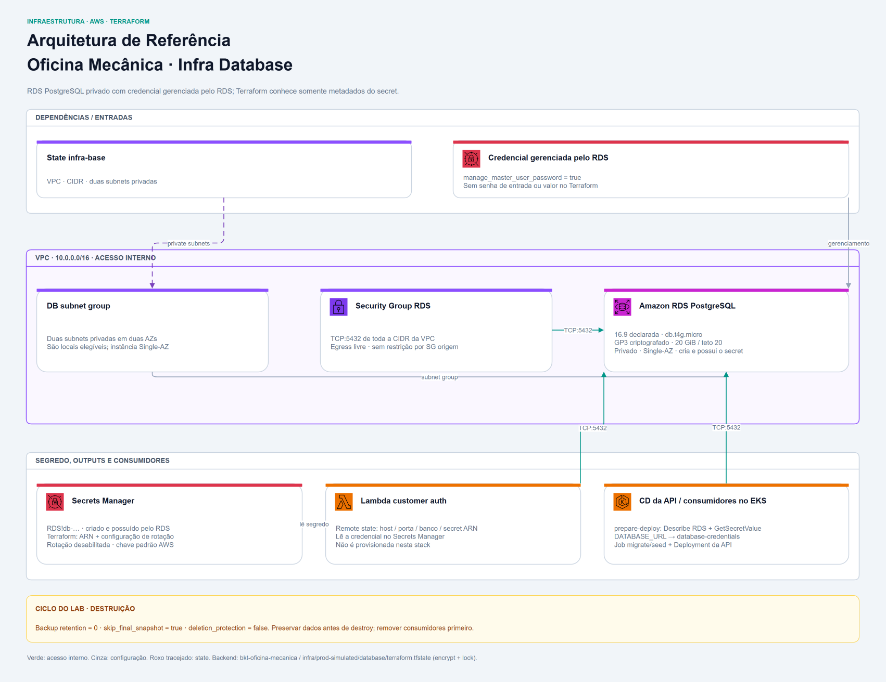

<div align="center">

# 🐘 Oficina Mecânica — Banco de Dados Relacional AWS RDS (IaC)

**Provisionamento automatizado do banco de dados relacional Amazon RDS PostgreSQL na AWS com Terraform para a solução Oficina Mecânica.**


</div>

## 📋 Sobre

Este repositório contém o código de **Infraestrutura como Código (IaC)** responsável pelo provisionamento do banco de dados relacional gerenciado **Amazon RDS (PostgreSQL)** para a aplicação **Oficina Mecânica**.

Faz parte do ecossistema de serviços e infraestrutura da pós-graduação em Arquitetura de Software da FIAP (turma 15SOAT).

A [API](https://github.com/FIAP-15SOAT/oficina-mecanica-api) é a entrada central da documentação da solução.

---

### 🏗️ Recursos Provisionados

1. **Amazon RDS PostgreSQL (`rds.tf`)**:
   - Instância gerenciada do PostgreSQL na versão declarada **16.9**, **Single-AZ** por padrão para otimizar custos de laboratório. `auto_minor_version_upgrade = true` permite upgrades menores gerenciados; a versão live não é inferida só desse valor declarado.
   - Tipo de instância padrão **`db.t4g.micro`**, configurável por `db_instance_class`.
   - Armazenamento **20 GiB GP3**, com criptografia em repouso (`storage_encrypted = true`). O teto também é 20 GiB, portanto não há margem de crescimento automático com os defaults atuais.
   - Acesso privado (`publicly_accessible = false`) nas subnets privadas da VPC; porta padrão 5432, banco e usuário mestre padrão `techchallenge`.
   - Backups automáticos desabilitados (`backup_retention_period = 0`), `skip_final_snapshot = true` e `deletion_protection = false`, permitindo descarte no ciclo de laboratório. A destruição com esses valores remove a instância sem snapshot final.

2. **DB Subnet Group (`rds.tf`)**:
   - Agrupa as duas subnets privadas da infra-base em `dbsng-oficina-mecanica`, cobrindo duas AZs elegíveis para a instância.
   - Com `multi_az = false`, esse agrupamento não cria réplica standby nem failover Multi-AZ.

3. **Security Group do RDS (`security_group.tf`)**:
   - `secgrp-rds-oficina-mecanica` libera TCP na porta do banco a partir de **toda a CIDR da VPC**, padrão `10.0.0.0/16`, com saída sem restrição.
   - A regra permite a comunicação interna de EKS/Lambda, mas não restringe o acesso apenas aos pods ou a um SG de origem. Um terminal externo precisa de conectividade interna apropriada para acessar o banco privado.

4. **Master password gerenciada pelo RDS (`rds.tf` e `secrets.tf`)**:
   - `manage_master_user_password = true` delega ao RDS a geração e o lifecycle da credencial, mantida em um Secret do AWS Secrets Manager que pertence à instância.
   - O Terraform publica somente o ARN computado. Ele não recebe senha, não escreve `SecretString` e não cria versão própria do Secret; a chave de criptografia é a padrão do Secrets Manager.
   - A rotação automática fica explicitamente desabilitada, sem Lambda de rotação. O contrato, o impacto no State e as alternativas estão no [ADR 0003](docs/adr/0003-master-password-gerenciada-pelo-rds.md).



### Credenciais, consumidores e migrações

- A [Lambda de autenticação](https://github.com/FIAP-15SOAT/oficina-mecanica-lambda-customer-auth) lê host, porta, banco e ARN pelo remote state, obtendo `username`/`password` diretamente do Secret gerenciado pelo RDS com sua role existente.
- A [API](https://github.com/FIAP-15SOAT/oficina-mecanica-api) usa o identificador não sensível da instância para descobrir metadados e o ARN durante o CD. O workflow lê `AWSCURRENT`, cria `database-credentials` no Kubernetes e não mantém senha, host ou ARN no GitHub.
- O job `db-migrate` do **CD da API** executa `prisma migrate deploy` dentro do EKS antes de `app-deploy`. Este Terraform provisiona o banco, mas não cria tabelas nem executa migrations.
- Uma nova versão de `AWSCURRENT` exige nova execução do CD da API para materializar a URL. No escopo greenfield, isso não reinicia Pods existentes automaticamente com a mesma imagem; uma troca manual posterior exige também sua renovação explícita. A rotação automática não está habilitada nesta entrega.

---

## 📁 Estrutura do Repositório

```text
.
├── .github/
│   └── workflows/
│       ├── cd.yml  # Apply na main, controlado por ENABLE_DEPLOY ou disparo manual
│       └── ci.yml  # Valida Terraform e abre PR; plan condicionado a credenciais
├── docs/
│   ├── adr/
│   │   ├── 0001-banco-gerenciado-amazon-rds.md
│   │   └── 0002-credencial-via-variavel-terraform-sensivel.md
│   ├── diagrams/
│   │   ├── cd-workflow.png  # Job e steps do workflow de CD
│   │   ├── ci-workflow.png  # Jobs e steps do workflow de CI
│   │   └── infrastructure.png  # Arquitetura do componente
│   └── ci-cd.md  # Jobs, steps, conditions e diagramas de CI/CD
├── terraform/
│   ├── .terraform.lock.hcl  # Versões e checksums dos providers
│   ├── backend.tf  # Backend S3 e lock nativo
│   ├── locals.tf  # Seleção/convenções locais de recursos
│   ├── outputs.tf  # Outputs de integração
│   ├── providers.tf  # Providers e leitura de remote state quando aplicável
│   ├── rds.tf  # RDS PostgreSQL e DB subnet group
│   ├── secrets.tf  # Configuração explícita de rotação do Secret gerenciado
│   ├── security_group.tf  # Security Group do banco
│   ├── terraform.tfvars.example  # Referência para configurar o ambiente
│   └── variables.tf  # Variáveis de entrada
├── .gitignore  # Arquivos locais ignorados
└── README.md  # Entrada do componente e guia local
```

---

## 💾 Estado Remoto (Remote State)

O estado do Terraform é armazenado remotamente no Amazon S3, com criptografia
e lock nativo (`use_lockfile = true`):

- **Bucket**: `bkt-oficina-mecanica`
- **Chave (Key)**: `infra/prod-simulated/database/terraform.tfstate`
- **Região**: `us-east-1`

O bucket deve existir, e a identidade AWS precisa acessar state e lockfile.
Bucket e keys permanecem estáveis na renomeação dos repositórios.

### 🔗 Integração com `oficina-mecanica-infra-base`

Este repositório consome VPC, CIDR e subnets privadas provisionados pela
[infra-base](https://github.com/FIAP-15SOAT/oficina-mecanica-infra-base) via
**Remote State**. Aplique a rede antes do banco:

```hcl
data "terraform_remote_state" "aws_base" {
  backend = "s3"
  config = {
    bucket = var.aws_base_state_bucket
    key    = var.aws_base_state_key
    region = var.aws_base_state_region
  }
}
```

Os defaults são o bucket acima, a key
`infra/prod-simulated/infra-base/terraform.tfstate` e a região `us-east-1`.
`backend.tf` define o state desta stack; `providers.tf` faz a leitura do state
da rede e `locals.tf` usa seus outputs.

---

## 🔐 Configuração de Secrets e Variáveis no GitHub Actions

Para a execução automatizada dos pipelines de CI e CD, configure os seguintes parâmetros nas configurações do repositório:

### Secrets do GitHub (`Settings > Secrets and variables > Actions > Secrets`)

| Secret | Descrição |
|---|---|
| `AWS_ACCESS_KEY_ID` | Access Key do AWS Academy / Learner Lab |
| `AWS_SECRET_ACCESS_KEY` | Secret Access Key do AWS Academy |
| `AWS_SESSION_TOKEN` | Token temporário de sessão do AWS Academy |
| `BOT_PRIVATE_KEY` | Chave privada (`.pem`) do GitHub App para autenticação de automação de PRs |

### Variáveis do GitHub (`Settings > Secrets and variables > Actions > Variables`)

| Variável | Valor Padrão | Descrição |
|---|---|---|
| `BOT_APP_ID` | — | ID numérico do GitHub App configurado na Organização |
| `ENABLE_DEPLOY` | Conforme o ambiente | Habilita a execução do job `terraform apply` no workflow de CD |

O disparo manual do CD também precisa selecionar `main`. Consulte [CI/CD](docs/ci-cd.md) para as conditions e steps completos.

---

## ⚙️ Variáveis e Saídas

### Principais Variáveis de Entrada

| Variável | Tipo | Default | Descrição | Uso |
| --- | --- | --- | --- | --- |
| `aws_region` | `string` | `us-east-1` | Região dos recursos | Configura o provider AWS usado para provisionar RDS, Security Group e segredo de credenciais. |
| `project_name` | `string` | `oficina-mecanica` | Compõe nomes | Forma os nomes do RDS, subnet group, Security Group e segredo `<project_name>/database/credentials`, além da tag `Project`. |
| `environment` | `string` | `prod-simulated` | Tag Environment | Identifica o ambiente nas tags dos recursos via `default_tags`; alterar esse valor não muda as keys dos states. |
| `aws_base_state_bucket` | `string` | `bkt-oficina-mecanica` | Bucket da infra-base | Indica o bucket S3 de onde `terraform_remote_state.aws_base` lê os dados da rede já provisionada. |
| `aws_base_state_key` | `string` | `infra/prod-simulated/infra-base/terraform.tfstate` | Key estável da infra-base | Seleciona o state que fornece `vpc_id`, `vpc_cidr` e `private_subnet_ids` para o Security Group e o subnet group do RDS. |
| `aws_base_state_region` | `string` | `us-east-1` | Região do state de rede | Configura a região de acesso ao bucket S3 na leitura do remote state da infra-base. |
| `db_engine_version` | `string` | `16.9` | Versão declarada do PostgreSQL | Preenche `engine_version` da instância RDS ao provisionar ou atualizar o banco. |
| `db_instance_class` | `string` | `db.t4g.micro` | Classe RDS | Preenche `instance_class` da instância, selecionando sua capacidade de processamento e memória. |
| `db_allocated_storage` | `number` | `20` | Armazenamento em GiB | Define a capacidade inicial do volume `gp3` criptografado associado ao RDS. |
| `db_max_allocated_storage` | `number` | `20` | Teto de armazenamento; igual ao inicial não deixa margem para crescimento | Preenche `max_allocated_storage` do RDS; deve ser maior que `db_allocated_storage` para permitir crescimento automático do volume. |
| `db_name` | `string` | `techchallenge` | Banco inicial; a referência tfvars usa techchallenge | Cria o banco inicial no RDS e fornece o output homônimo; os consumidores usam esse nome para selecionar o banco na conexão. |
| `db_username` | `string` | `techchallenge` | Master username; a referência tfvars usa techchallenge | Configura o usuário mestre do RDS e o campo `username` do Secret gerenciado; a API o descobre em `DescribeDBInstances`. |
| `db_port` | `number` | `5432` | Porta PostgreSQL/SG | Configura a porta de conexão do RDS e a regra de entrada do Security Group que permite acesso a partir do CIDR da VPC. |
| `multi_az` | `bool` | `false` | Habilita Multi-AZ; padrão Single-AZ | Preenche `multi_az` da instância RDS; o valor atual mantém o banco na configuração Single-AZ da solução. |
| `backup_retention_period` | `number` | `0` | Dias de backup automático; zero desabilita | Configura a retenção de backups automáticos na instância RDS; definir um valor positivo habilita sua retenção pelo período escolhido. |
| `skip_final_snapshot` | `bool` | `true` | True não gera snapshot final no destroy | Controla a criação de snapshot final ao remover o RDS com `terraform destroy`; o default permite a remoção sem esse snapshot. |

---

### Saídas Exportadas (Outputs)

A Lambda lê `db_host`, `db_port`, `db_name` e `db_credentials_secret_arn` pelo
remote state. A API descobre os mesmos metadados no RDS durante seu CD, a partir
do identificador não sensível da instância, e não consome esse State.
As demais saídas servem como referências operacionais e não são consumidas
automaticamente pelas stacks atuais.

| Output | Descrição | Exemplo | Uso |
| --- | --- | --- | --- |
| `db_instance_id` | Identificador da instância RDS | — | Permite localizar a instância no console e consultar seu status, eventos e configuração. |
| `db_instance_arn` | ARN da instância | — | Permite referenciar a instância por seu identificador completo em consultas e políticas IAM que precisem desse recurso. |
| `db_endpoint` | Host e porta combinados para conexão | `rds-oficina-mecanica.xxxx.us-east-1.rds.amazonaws.com:5432` | Fornece o destino `host:porta` para configurar clientes PostgreSQL e verificar a conectividade a partir da VPC. |
| `db_host` | Endereço DNS do host | `rds-oficina-mecanica.xxxx.us-east-1.rds.amazonaws.com` | Preenche `DATABASE_HOST` da Lambda via remote state; a API descobre o endpoint diretamente no RDS durante o CD. |
| `db_address` | Endereço DNS do host (alias para `db_host`) | `rds-oficina-mecanica.xxxx.us-east-1.rds.amazonaws.com` | Oferece o mesmo endereço para configurações que usem o nome `db_address`; a integração atual da Lambda lê `db_host`. |
| `db_port` | Porta do PostgreSQL | `5432` | Preenche `DATABASE_PORT` da Lambda via remote state e é descoberto pela API durante o CD. |
| `db_name` | Nome inicial do banco | `techchallenge` | Preenche `DATABASE_NAME` da Lambda via remote state e é descoberto pela API durante o CD. |
| `db_security_group_id` | ID do Security Group do RDS | `sg-0123456789abcdef0` | Permite localizar e inspecionar as regras de rede do banco ao investigar falhas de acesso a partir da VPC. |
| `db_credentials_secret_arn` | ARN do Secret gerenciado pelo RDS | — | Preenche `DATABASE_SECRET_ID` da Lambda via remote state; a API descobre o ARN em `MasterUserSecret` durante o CD. |

---

## 🚀 Como Executar Localmente

### Pré-requisitos

- **Terraform ≥ 1.11.0** e **AWS provider ≥ 6.46.0/<7**. Consulte a versão instalada no lockfile local.
- **AWS CLI v2** configurada com as três credenciais temporárias do AWS Academy.
- Infra-base previamente aplicada, com acesso aos states/lockfiles S3 e permissões RDS/Secrets Manager.
- Valores de `terraform.tfvars.example` revisados; não há `terraform.tfvars` versionado. Esse nome é ignorado pelo `.gitignore`. Se já houver um arquivo local, preserve-o e confira os valores em vez de sobrescrevê-lo.

### Passos para Inicialização e Deploy

Na raiz do clone, com sessão AWS válida:

```bash
# 1. Acessar o diretório da configuração Terraform
cd terraform

# 2. Inicializar os providers e o backend remoto
terraform init

# 3. Verificar a formatação sem modificar os arquivos
terraform fmt -check -recursive

# 4. Validar a sintaxe e a consistência da configuração
terraform validate

# 5. Visualizar o plano de execução
terraform plan

# 6. Aplicar a infraestrutura após revisar o plano
terraform apply

# 7. Consultar os outputs para configurar API e Lambda
terraform output
```

### Validação estática, sem sessão AWS ativa

Na pasta `terraform/`, sem conectar ao backend ou aos recursos AWS:

```bash
# Verificar a formatação da configuração
terraform fmt -check -recursive

# Instalar os providers sem inicializar o backend remoto
terraform init -backend=false

# Validar a configuração com os schemas dos providers instalados
terraform validate
```

A instalação exige registry ou cache. Se já houver lockfile e quiser preservar
versões/checksums, acrescente `-lockfile=readonly`. Após a inicialização
estática, execute `terraform init -reconfigure` antes de um plan remoto.
`validate` não comprova permissões, conectividade SQL ou resultado de um plan.

### Encerramento do laboratório

- Remova primeiro Lambda e workloads dependentes.
- Preserve os dados necessários antes do destroy: os defaults não geram backup automático ou snapshot final, e o segredo tem exclusão imediata.
- Destrua o database antes da infra-base, com sessão válida:

```bash
# Revisar a remoção do banco, SG, subnet group e segredo
terraform plan -destroy

# Remover os recursos após encerrar os consumidores e preservar os dados necessários
terraform destroy
```

RDS, armazenamento e Secrets Manager consomem crédito enquanto existem.
Encerrar a sessão do laboratório não comprova a remoção. O backend é externo
à stack; não há workflow de destroy neste repositório.

---

## 🔄 Pipelines de CI/CD

O repositório conta com dois workflows automatizados via GitHub Actions:

- **CI**: push em `feature/**` e `fix/**`; valida Terraform, faz plan quando a autenticação AWS está disponível e abre PR para `main` com GitHub App.
- **CD**: push em `main` ou `workflow_dispatch`; executa plan/apply sob `production`, com gate por `main` e `ENABLE_DEPLOY` ou disparo manual. Não há dependência `needs` entre os dois workflows.

A [documentação de CI/CD](docs/ci-cd.md) explica cada job/step, conditions, autenticação, configuração GitHub e falhas, e **renderiza os diagramas de CI e CD**.

---

## 📐 Decisões Arquiteturais

- [ADR 0001 — Banco de dados relacional como serviço gerenciado (Amazon RDS)](docs/adr/0001-banco-gerenciado-amazon-rds.md)
- [ADR 0002 — Senha do banco por variável Terraform sensível e publicação no Secrets Manager (substituído)](docs/adr/0002-credencial-via-variavel-terraform-sensivel.md)
- [ADR 0003 — Master password gerenciada pelo Amazon RDS](docs/adr/0003-master-password-gerenciada-pelo-rds.md)
